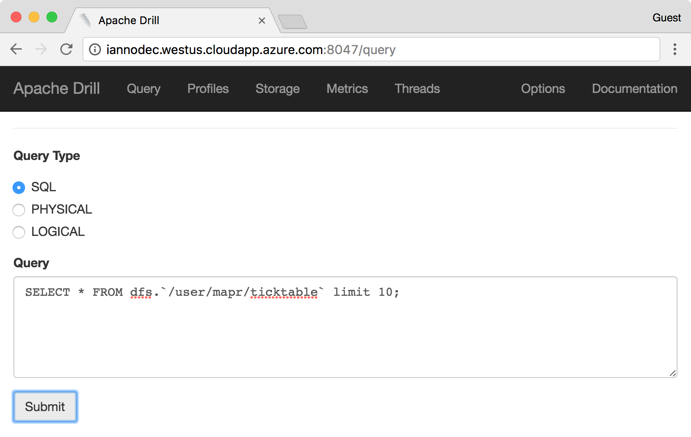
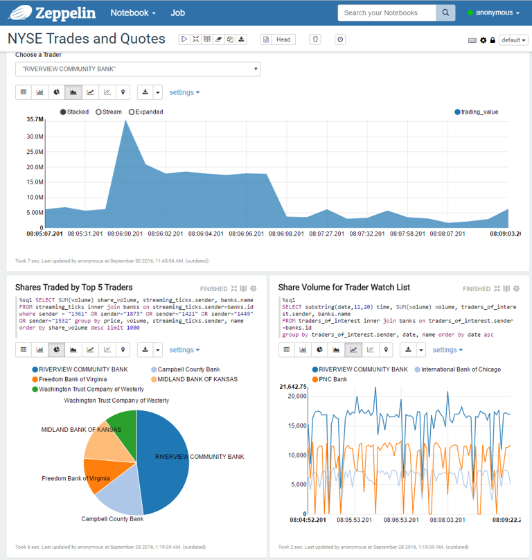
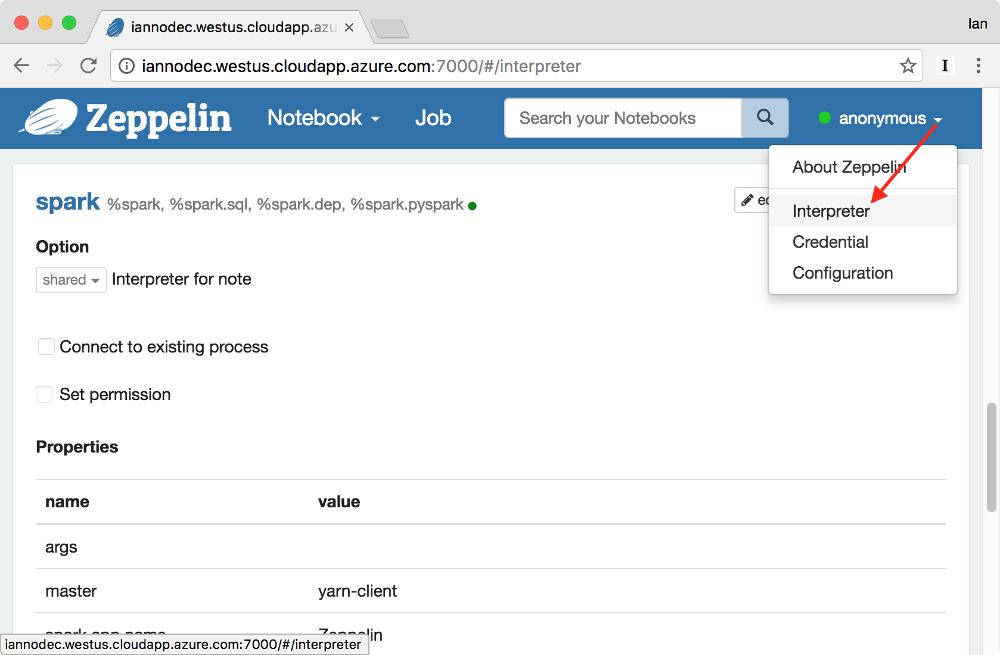

BY USING THIS SOFTWARE, YOU EXPRESSLY ACCEPT AND AGREE TO THE TERMS OF THE AGREEMENT CONTAINED IN THIS GITHUB REPOSITORY.  See the file EULA.md for details.

#  An Example Application for Processing Stock Market Trade Data on the MapR Converged Data Platform

This project provides a processing engine for ingesting real time streams of trades, bids and asks into MapR Streams at a high rate.  The application consists of the following components:
- A Producer microservice that streams trades, bids and asks using the NYSE TAQ format.  The data source is the Daily Trades dataset described [here](http://www.nyxdata.com/Data-Products/Daily-TAQ). The schema for our data is detailed in Table 6, "Daily Trades File Data Fields", on page 26 of [Daily TAQ Client Specification (from December 1st, 2013)](http://www.nyxdata.com/doc/212759).  
- A multi-threaded Consumer microservice that indexes the trades by receiver and sender.
- Example Spark code for querying the indexed streams at interactive speeds, enabling Spark SQL queries.  
- Example code for persisting the streaming data to MapR-DB 
- Performance tests for benchmarking different configurations
- A supplementary python script to enhance the above TAQ dataset with "level 2" bid and ask data at a user-defined rate.

The intent of the application is to serve as a "blueprint" for building high-speed streaming applications on the MapR Converged Data Platform.  You can use the code as a base for developing your own workflow, including producers, consumers and analytical engines, and run queries against the indexed topics.  

There are several beneficial aspects of the application that are worth highlighting:

- The Consumer microservice, performing the indexing, can be arbitrarily scaled simply by running more instances.  See below in this README for how to start the application.
- Jackson annotations are provided for easy translation of the data structures to JSON and persistence to MapR-DB.
- The application can handle 300,000 entries/second on a 3-node cluster, which is suitable for testing.  It does not require a large cluster, and takes advantage of the scaling properties of MapR Streams.
- The resulting index topics are small, and can be queried fast enough such that they can be used for interactive dashboards, such as in a Zeppelin notebook.

## Architecture

The following diagram shows how data moves through the architecture of this application. The rounded rectangles represent processes that produce and/or consume data from MapR Streams topics. Java based microservices are used to ingest and manipulate streaming data using the Kafka API. Spark and Apache Zeppelin are used to provide streaming analytics and batch oriented visualization.


## Prerequisites

To get the application running you will need a cluster or single node with MapR 5.1 or greater.  You can use the free [Converged Community Edition](http://mapr.com/download) or the [Converged Enterprise Edition](https://www.mapr.com/products/mapr-distribution-editions).  The example will also run on the [MapR Sandbox](http://mapr.com/sandbox).  Optionally, you will need python 2.7 to run the data generation script.  Some performance tests that use R are also provided (see the section below about Testing Speeds for Different Configurations).

You will also need git and Apache Maven in order to download and compile the provided source code.

## Building the application

Clone this repo and build the application with Maven.  A pom.xml file is included in the base directory. The remainder of this guide will assume that you clone the package to /home/mapr/.

```
cd /home/mapr/
git clone http://github.com/mapr-demos/finserv-application-blueprint.git
cd finserv-application-blueprint
mvn clean install
```
At this point you should see the resulting jar file in the target/ directory:  ```nyse-taq-streaming-1.0.jar```

Copy that jar package to the /home/mapr/ directory on each of your cluster nodes:

```
scp ./target/nyse-taq-streaming-1.0-jar mapr@<YOUR_MAPR_CLUSTER>:/home/mapr
```

## Preparing the Platform and Running the Application

Follow the steps in this section to run the application.  You can run these commands on any node in the cluster, but you may want separate the consumer and producer processes onto separate nodes for higher performance.

Optionally you can also run the application from a client node.  To setup one, install the [MapR Client](http://maprdocs.mapr.com/51/index.html#AdvancedInstallation/SettingUptheClient-client_26982445-d3e146.html) and run the application locally.

### Step 1: Create the stream

A *stream* is a logical grouping of topics. They give us a way to group together topics and protect those topics with a single set of security permissions and other properties. MapR supports the Kafka API for interacting with streams.  For more information on Streams, see [https://www.mapr.com/products/mapr-streams](https://www.mapr.com/products/mapr-streams).

Run the following command from any node in your MapR cluster:

```
maprcli stream create -path /user/mapr/taq -produceperm p -consumeperm p -topicperm p -ttl 900
```

In that command we created the topic with public permission since we want to be able to run producers and consumers from remote computers. Verify the stream was created with this command:

```
maprcli stream info -path /user/mapr/taq
```

### Step 2: Create the topics

We only need to create one topic to get started, the rest are created by the application. Topics are created with the `maprcli` tool.  Run this command on a single node in the cluster:

```
maprcli stream topic create -path /user/mapr/taq -topic trades -partitions 3
```

Verify the topic was created successfully with this command:

```
maprcli stream topic list -path /user/mapr/taq
```

This enables 3 partitions in the topic for scaling across threads, more information on how partitions work can be found [here](http://maprdocs.mapr.com/51/MapR_Streams/concepts.html).

### Step 3: Start the "Fan Out" Consumer

We use a multi-threaded microservice that indexes the incoming information into separate topics by receiver and sender. We call this a "fan out" consumer, because it consumes tick data from incoming stock exchange stream and copies each tick record into topics belonging to all the participants of a trade. So for example, if this consumer sees an offer by Sender X to sell shares to recipients A, B, and C, then this consumer will copy that tick to four new topics, identified as sender_X, receiver_A, receiver_B, and receiver_C. This relationship is illustrated below:


A "tick" of this data consists of:
```
{time, sender, id, symbol, prices, ..., [recipient*]}
```
For each message in the stream there is a single sender and multiple possible receipients.  The consumer will index these into separate topics so they can be queried.

Run the following command to start the consumer:

```
java -cp `mapr classpath`:/home/mapr/nyse-taq-streaming-1.0.jar:/home/mapr/finserv-application-blueprint/src/test/resources com.mapr.demo.finserv.Run consumer /user/mapr/taq:trades 3
```

In this example we are starting 3 threads to handle the 3 partitions in topic, ```/user/mapr/taq:trades```.

### Step 4: Run the Producer

Run the producer with the following command. This will send all the trades contained in files under finserv-application-blueprint/data/ to `/user/mapr/taq:trades`, where '/user/mapr/taq' is the stream and 'trades' is the topic. 

```
java -cp `mapr classpath`:/home/mapr/nyse-taq-streaming-1.0.jar com.mapr.demo.finserv.Run producer /home/mapr/finserv-application-blueprint/data/ /user/mapr/taq:trades
```

A small data file representing one second of trades, bids and asks (```data/080449```) is provided for convenience.  To generate more data, see the section 'Generating Data' below.


You should see the producer running and printing throughput numbers:
```
Throughput = 0.00 Kmsgs/sec published. Threads = 1. Total published = 2.
Throughput = 202.78 Kmsgs/sec published. Threads = 1. Total published = 411107.
Throughput = 377.08 Kmsgs/sec published. Threads = 1. Total published = 1139858.
Throughput = 463.34 Kmsgs/sec published. Threads = 1. Total published = 1865937.
Throughput = 478.99 Kmsgs/sec published. Threads = 1. Total published = 2406537.
```

This simulates "live" bids, asks and trades streaming from an exchange.

### Step 5: Persist stream data in a database

#### Persist stream data with MapR-DB

The class ```Persister.java``` is provided as a code example to help you get familiar with the MapR-DB and OJAI APIs, and persists data to MapR-DB that it consumes a topic.  You can run this class with the following command line:

```
java -cp `mapr classpath`:/home/mapr/nyse-taq-streaming-1.0.jar com.mapr.demo.finserv.Persister /user/mapr/taq:sender_0110
```
This causes trades, bids and asks sent by sender ID ```0110``` to be persisted to MapR-DB in a table located at /mapr/ian.cluster.com/user/mapr/ticktable. Here are some examples of how you can query this table:

Here’s how to query the MapR-DB table with dbshell:

```
mapr dbshell
  maprdb mapr:> find /user/mapr/ticktable
```

If you've installed Apache Drill, here’s how to query the MapR-DB table from the command line:

	/opt/mapr/drill/drill-*/bin/sqlline -u jdbc:drill:
	0: jdbc:drill:> SELECT * FROM dfs.`/user/mapr/ticktable` LIMIT 10;

You can also perform that SQL query in the Drill web interface, which by default runs on port 8047, as shown below:




#### Persist stream data with Apache Hive

The ```SparkStreamingToHive``` class uses the Spark Streaming API to copy messages from the tail of streaming topics to Hive tables that can be analyzed in Zeppelin. Zeppelin can't directly access stream topics, so we use this utility to access streaming data from Zeppelin. Here's how to run this class:

```
/opt/mapr/spark/spark-*/bin/spark-submit --class com.mapr.demo.finserv.SparkStreamingToHive /home/mapr/nyse-taq-streaming-1.0.jar /user/mapr/taq:trades streaming_ticks
```

That command will only see *new* messages in the trades topic because it tails the log, so when it says "Waiting for messages" then run the following command to put more trade data into the stream. This command was described in [step 4](https://github.com/mapr-demos/finserv-application-blueprint#step-4-run-the-producer):

```
java -cp `mapr classpath`:/home/mapr/nyse-taq-streaming-1.0.jar com.mapr.demo.finserv.Run producer /home/mapr/finserv-application-blueprint/data/ /user/mapr/taq:trades
```

In the previous command, we consumed from the trades topic, which is the raw stream for every trader. If you want to save only trades from a specific trader, then run the following command. This will read messages from the topic associated with the trader called ```sender_0410``` and copy those messages to Hive. Remember, this tail operation so it will wait for new messages on that topic. 

```
/opt/mapr/spark/spark-*/bin/spark-submit --class com.mapr.demo.finserv.SparkStreamingToHive /home/mapr/nyse-taq-streaming-1.0.jar /user/mapr/taq:sender_0410 ticks_from_0410
```

We've provided another Spark Streaming example which reads messages delivered over a user-specified time range. Essentially, this allows one to ask, "Show me all the trades by trader X that were sent within the last 60 seconds". This is a good example of how Spark Streaming can use offsets to subset data in a topic. It's also useful for debugging purposes, if for example you want to see the messages at the tail of a topic. This utility can be run like this: 

```
/opt/mapr/spark/spark-*/bin/spark-submit --class com.mapr.demo.finserv.SparkStreamingConsole /home/mapr/nyse-taq-streaming-1.0.jar /user/mapr/taq:sender_0410
```

### Step 6: Build a Dashboard in Apache Zeppelin

There are many frameworks we could use to build an operational dashboard. [Apache Zeppelin](https://zeppelin.apache.org/) is a good choice because it supports a variety of ways to access data. Our goal is to build a dashboard that looks like this:



Here's what you need to do to setup a dashboard like that:

#### Install and Configure Zeppelin

In a production environment you'd probably want to run Zeppelin on a workstation with the ```mapr-client``` package installed, but just to keep things simple we're going to assume you're running Zeppelin on one of your MapR cluster nodes.

Download the latest Zeppelin snapshot with this command:

```
git clone https://github.com/apache/zeppelin.git
```

Compile it with the following command (this works on MapR 5.2):

```
cd zeppelin
mvn package -Pbuild-distr -Pmapr51 -Pyarn -Pspark-1.6 -DskipTests -Phadoop2.7
```

Run these commands to tell Zeppelin where Spark is installed:

```
echo "export HADOOP_CONF_DIR=\"/opt/mapr/hadoop/hadoop-2.7.0/etc/hadoop\"" >> /opt/zeppelin/conf/zeppelin-env.sh
echo "export ZEPPELIN_JAVA_OPTS=\"-Dspark.executor.instances=4 -Dspark.executor.memory=2g\"" >> /opt/zeppelin/conf/zeppelin-env.sh
echo "export SPARK_HOME=\"/opt/mapr/spark/spark-1.6.1\"" >> /opt/zeppelin/conf/zeppelin-env.sh
```

In order for Spark (and hence Zeppelin) to see Hive tables, Spark needs to be directed to use the Hive Metastore. Copy the hive-site.xml from the Hive conf directory to the Spark config directory, like this:

```
cp /opt/mapr/hive/hive-*/conf/hive-site.xml /opt/mapr/spark/spark-*/conf/
```

Open the options for Zeppelin's Spark interpreter, as shown below:



Ensure that the Zeppelin Spark interpreter is configured with the following options:

```
master	yarn-client
spark.app.name	Zeppelin
spark.executor.memory	2g
zeppelin.dep.additionalRemoteRepository	spark-packages,http://dl.bintray.com/spark-packages/maven,false;
zeppelin.dep.localrepo	local-repo
zeppelin.interpreter.localRepo	/home/mapr/zeppelin-0.7.0-SNAPSHOT/local-repo/2BX9VZF48
zeppelin.pyspark.python	python
zeppelin.spark.concurrentSQL	false
zeppelin.spark.importImplicit	true
zeppelin.spark.maxResult	1000
zeppelin.spark.printREPLOutput	true
zeppelin.spark.sql.stacktrace	true
zeppelin.spark.useHiveContext	true
```

Setup Zeppelin to run automatically as a Linux daemon. The following steps should work for CentOS:

```
mv ~/zeppelin /opt/
echo "# chkconfig: 2345 90 60" >> /etc/init.d/zeppelin
echo "test -e /opt/zeppelin/bin/zeppelin-daemon.sh || exit 1" >> /etc/init.d/zeppelin
echo "exec su -s /bin/bash -c \"/opt/zeppelin/bin/zeppelin-daemon.sh \$@\" mapr" >> /etc/init.d/zeppelin
chkconfig --add zeppelin
chkconfig --list zeppelin
```

Start Zeppelin, like this:

```
service zeppelin start
```

#### Create Hive tables

Import the bank company names into a new hive table. Later, we'll map these names to bank IDs with a table join in Zeppelin. 

```
hive
  hive> CREATE TABLE banks(id int, name string) ROW FORMAT DELIMITED FIELDS TERMINATED BY ',';
  hive> LOAD DATA LOCAL INPATH '/home/mapr/finserv-application-blueprint/data/bank_list.csv' INTO TABLE banks;
```

Run this command to load streaming data into a Hive table:

```
/opt/mapr/spark/spark-*/bin/spark-submit --class com.mapr.demo.finserv.SparkStreamingToHive /home/mapr/nyse-taq-streaming-1.0.jar /user/mapr/taq:trades streaming_ticks
```

That command will only see *new* messages in the trades topic because it tails the log, so when it says "Waiting for messages" then run the following command to put more trade data into the stream:

```
java -cp `mapr classpath`:/home/mapr/nyse-taq-streaming-1.0.jar com.mapr.demo.finserv.Run producer /home/mapr/finserv-application-blueprint/data/ /user/mapr/taq:trades
```


#### Building Visualizations

Zeppelin divides notebooks into subsections called *paragraphs*. First, create a new notebook in Zeppelin, then in a new paragraph enter the following and press the 'Play' icon (or keyboard shortcut, Shift+Enter):

```
%sql show tables
```

You should see the ```banks``` and ```streaming_ticks``` tables in the list. If not, look in /opt/zeppeling/logs/*.log for an error.

We've provided a sample Zeppelin notebook which includes some sample SQL queries and charts to get you started. Load the finserv-application-blueprint/data/note.json file with the Import feature in the Zeppelin web UI. After you've imported it, you should see a new notebook called "Stock Exchange Analysis" in Zeppelin. You should see something like the screenshot below:


## Cleaning Up

When you are done, you can delete the stream, and all associated topic using the following command:

```
maprcli stream delete -path /user/mapr/taq
```

Remove the Hive table:

```
rm -rf /mapr/ian.cluster.com/user/hive/warehouse/streaming_ticks/
```

### Generating Data

The source data files are kept in a separate repo to keep this one to a manageable size.  To get more data, perform the following steps.  You can either use the larger starting set of data files provided here, or run the provided script ```prepticks.py``` to generate more from scratch.  This will take the NYSE TAQ file as input and generate simulated bids and asks leading up to each trade, at a pre-defined rate per second.

First, download the data repo:

```
git clone https://github.com/mapr-demos/finserv-data-files
```

Expand the starter data files as follows:

```
cd finserv-data-files
mkdir data
tar xvfz starter_datafiles.tar.gz -C data
```

You can then pass this ```data``` directory to the consumer application above.

If you want to generate even more data (for example, to simulate an entire trading day) then run ```prepticks.py``` to generate it using the NYSE TAQ files.  First combine them:

```
cat taq/* >> data.zip
unzip data.zip
```
Now, go back to this repo and edit the file ```prepticks.py``` to point to the file you just unzipped and the output directory.  This will generate data for all events in the TAQ file.  A machine with 128G RAM is recommended for generating data.


# Get Community Support!

Visit the [MapR Community](https://community.mapr.com/) pages where you can post questions and discuss your use case.


