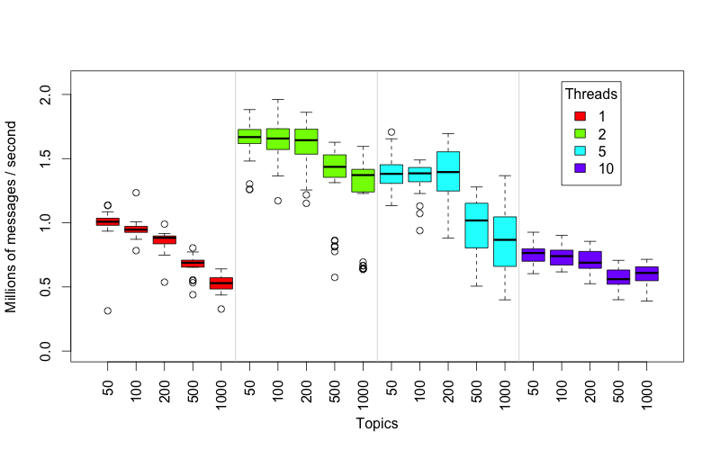
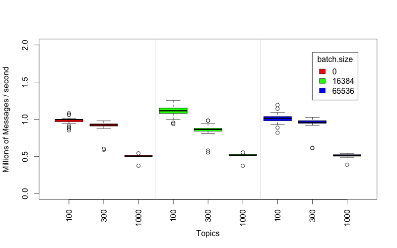

BY USING THIS SOFTWARE, YOU EXPRESSLY ACCEPT AND AGREE TO THE TERMS OF THE AGREEMENT CONTAINED IN THIS GITHUB REPOSITORY.  See the file EULA.md for details.

#  An Example Application for Processing Stock Market (NYSE) Data on the MapR Converged Data Platform

This project provides a processing engine for ingesting real time streams of trades, bids and asks into MapR Streams at a high rate.  The application consists of the following components:
- A Producer microservice that streams trades, bids and asks using the NYSE TAQ format.  The data source is the Daily Trades dataset described [here](http://www.nyxdata.com/Data-Products/Daily-TAQ). The schema for our data is detailed in Table 6, "Daily Trades File Data Fields", on page 26 of [Daily TAQ Client Specification (from December 1st, 2013)](http://www.nyxdata.com/doc/212759).  
- A multi-threaded Consumer microservice that indexes the trades by receiver and sender.
- Example Spark code for querying the indexed streams at interactive speeds, enabling Spark SQL queries.  
- Example code for persisting the streaming data to MapR-DB 
- Performance tests for benchmarking different configurations
- A supplementary python script to enhance the above TAQ dataset with "level 2" bid and ask data at a user-defined rate.

The intent of the application is to serve as a "blueprint" for building high-speed streaming applications on the MapR Converged Data Platform.  You can use the code as a base for developing your own workflow, including producers, consumers and analytical engines, and run queries against the indexed topics.  

There are several beneficial aspects of the application that are worth highlighting:

- The Consumer microservice, performing the indexing, can be arbitrarily scaled simply by running more instances.  See below in this README for how to start the application.
- The application can handle 300,000 entries/second on a 3-node cluster, which is suitable for testing.  It does not require a large cluster, and takes advantage of the scaling properties of MapR Streams.
- The resulting index topics are small, and can be queried fast enough such that they can be used for interactive dashboards, such as in a Zeppelin notebook.

## Pre-requisites

To get the application running you will need a cluster or single node with MapR 5.1 or greater.  You can use the free [Converged Community Edition](http://mapr.com/download) or the [Converged Enterprise Edition](https://www.mapr.com/products/mapr-distribution-editions).  The example will also run on the [MapR Sandbox](http://mapr.com/sandbox).  Optionally, you will need python 2.7 to run the data generation script.  Some performance tests that use R are also provided (see the section below about Testing Speeds for Different Configurations).

## Building the application

Clone this repo and build the application with Maven.  A pom.xml file is included in the base directory.

```
git clone http://github.com/mapr-demos/finserv-application-blueprint
cd finserv-application-blueprint
mvn install clean
```
At this point you should see the resulting jar file in the target/ directory:  ```nyse-taq-streaming-1.0.jar```

## Preparing the Platform and Running the Application

Follow the steps in this section to run the application.  You can run these commands on any node in the cluster, but you may want separate the consumer and producer processes onto separate nodes for higher performance.

Optionally you can also run the application from a client node.  To setup one, install the [MapR Client](http://maprdocs.mapr.com/51/index.html#AdvancedInstallation/SettingUptheClient-client_26982445-d3e146.html) and run the application locally.

If you build the .jar file on a machine where you will not be running it, simply copy the program to your server using scp:

```
scp ./target/nyse-taq-streaming-1.0-jar. mapr@<YOUR_MAPR_CLUSTER>:/home/mapr
```

Or, a faster way involves `rsync`:

```
rsync -vapr --progress --stats --partial target/nyse-taq-streaming-1.0-jar-with-dependencies.jar mapr@10.200.1.101:~/
```

### Step 1: Create the stream

A *stream* is a collection of topics that you can manage together for security, default number or partitions, and time to leave for the messages.  The Kafka API is supporte for applications.  For more information on Streams, [consult this overview page](https://www.mapr.com/products/mapr-streams).

Run the following command from a single node on the MapR cluster:

```
$ maprcli stream create -path /user/mapr/taq -produceperm p -consumeperm p -topicperm p -ttl 900
```

In that command we created the topic with public permission since we want to be able to run producers and consumers from remote computers. Verify the stream was created with this command:

```
maprcli stream info -path /user/mapr/taq
```

### Step 2: Create the topics

We only need to create one topic to get started, the rest are created by the application. Topics are created with the `maprcli` tool.  Run this command on a single node in the cluster:

```
$ maprcli stream topic create -path /user/mapr/taq -topic trades -partitions 3
```

Verify the topic was created successfully with this command:

```
$ maprcli stream topic list -path /taq
topic            partitions  logicalsize  consumers  maxlag  physicalsize
trades           1           0            0          0       0
```

This enables 3 partitions in the topic for scaling across threads, more information on how partitions work can be found [here](http://maprdocs.mapr.com/51/MapR_Streams/concepts.html).

### Step 3: Run the Producer

When you start the producer, it will send a large number of messages to `/user/mapr/taq:trades` (this denotes the '/user/mapr/taq' stream and the topic 'trades'). Since there isn't any consumer running yet, nothing will receive the messages.

Run the producer like this:

```
java -cp `mapr classpath`:./ com.mapr.demo.finserv.Run producer [source data file] [stream:topic]
```

A small data file representing one second of trades, bids and asks (```data/080449```) is provided for convenience.  To generate more data, see the section 'Generating Data' below.

For example, to run with the provided sample data, run:

```
java -cp ./target/nyse-taq-streaming-1.0.jar com.mapr.demo.finserv.Run producer /home/mapr/finserv-application-blueprint/data/ /user/mapr/taq:trades
```

You should see the producer running and printing throughput numbers:
```
Throughput = 0.00 Kmsgs/sec published. Threads = 1. Total published = 2.
Throughput = 202.78 Kmsgs/sec published. Threads = 1. Total published = 411107.
Throughput = 377.08 Kmsgs/sec published. Threads = 1. Total published = 1139858.
Throughput = 463.34 Kmsgs/sec published. Threads = 1. Total published = 1865937.
Throughput = 478.99 Kmsgs/sec published. Threads = 1. Total published = 2406537.
```

This simulates "live" bids, asks and trades streaming from an exchange.

### Step 4. Start the Spark Consumer

The consumer provides a multi-threaded microservice that indexes the incoming information into separate topics by receiver and sender.

A "tick" of this data consists of:
```
{time, sender, id, symbol, prices, ..., [recipient*]}
```
For each message in the stream there is a single sender and multiple possible receipients.  The consumer will index these into separate topics so they can be queried.

Run the following command to start the consumer:

```
java -cp ./target/nyse-taq-streaming-1.0.jar:./src/test/resources com.mapr.demo.finserv.Run consumer /user/mapr/taq:trades 3
```

In this example we are starting 3 threads to handle the 3 partitions and specified the topic name as ```/user/mapr/taq::trades```.

### Monitoring your topics 

You can use the `maprcli` tool to get some information about the topic, for example:

```
$ maprcli stream info -path /user/mapr/taq -json
$ maprcli stream topic info -path /user/mapr/taq -topic trades -json
```

If the MapR-FS filesystem runs out of free space, the kafka producers will fail, so keep an eye on disk space like this:

```
$ maprcli disk list -host iannodea
```

If the disk space fills up, it's easiest just to remove the stream then create it again.


Show me all the topics for my stream:

```
$ maprcli stream topic list -path /user/mapr/taq | awk '{print $4}' | sort | uniq -c
```

Show me the depth of the trades topic:

```
$ maprcli stream topic info -path /user/mapr/taq -topic trades | tail -n 1 | awk '{print $12-$2}'
```

## Cleaning Up

When you are done, you can delete the stream, and all associated topic using the following command:

```
$ maprcli stream delete -path /taq
```

Don't forget to recreate the stream before running the producer again.

Remove the Hive table:

```
$ rm -rf /mapr/ian.cluster.com/user/hive/warehouse/streaming_ticks/
```

# Performance Guidelines

In this section we discuss methods for benchmarking performance and observing how performance scales with to cluster size.

We suggest you use multiple partitions for the first stage of sending raw data to the taq:trades stream:topic, and use three consumer processes with two threads each for the middle stage of consuming that raw data and multiplexing it to receiver and sender topics.  To recap the above configuration, create your topic like this:

``` 
$ maprcli stream create -path /user/mapr/taq -ttl 300
$ maprcli stream topic create -path /user/mapr/taq -topic trades -partitions 3
```

Then run the consumers on three different cluster nodes, with 2 threads each, like this:

```
time java -cp `mapr classpath`:/mapr/tmclust1/user/mapr/resources:/mapr/tmclust1/user/mapr/nyse-taq-streaming-1.0-jar-with-dependencies.jar com.mapr.demo.finserv.Run consumer2  /user/mapr/taq:trades 2
```

Then run the producer like this:

```
java -cp `mapr classpath`:/mapr/tmclust1/user/mapr/nyse-taq-streaming-1.0-jar-with-dependencies.jar com.mapr.demo.finserv.Run producer nyse/1minute /user/mapr/taq:trades;
```

# Testing Speeds for Different Configurations

Included with this repo there are several unit tests that don't so much test anything as produce speed data
so that different configurations of producer threads can be adjusted to get optimal 
performance under different conditions. 

To run these tests do this in the top-level directory:

```
mvn -e -Dtest=TopicCountGridSearchTest,ThreadCountSpeedTest test
```

This will create two data files, `thread-count.csv` and `topic-count.csv`. These files can be visualized 
by running an analysis script:

    Rscript src/test/R/draw-speed-graphs.r 

This will create PNG images with figures something like these that we
produced on our test cluster:





# Get Community Support!

Visit the [MapR Community](https://community.mapr.com/) pages where you can post questions and discuss your use case.


